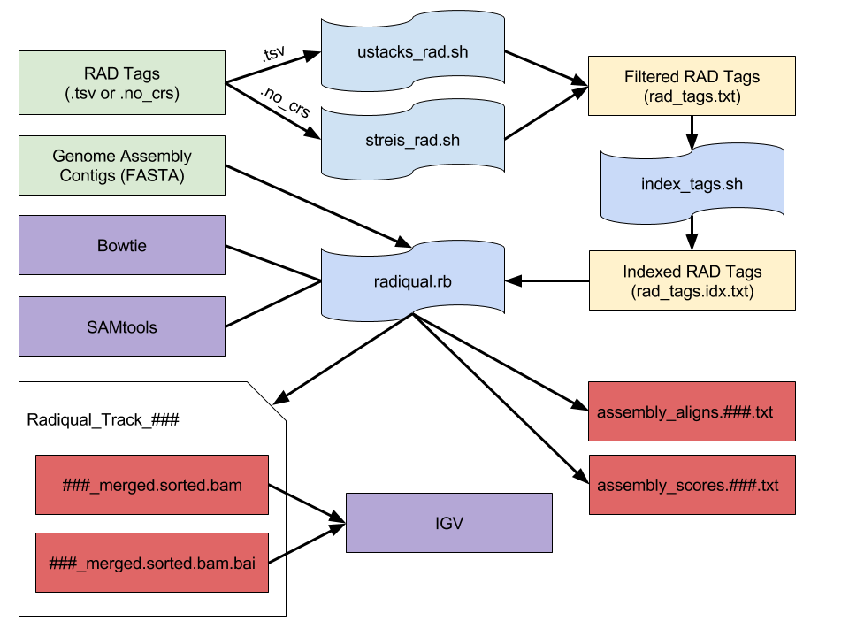

# RadiQual [](https://zenodo.org/badge/latestdoi/19044/joshuaburkhart/RadiQual)

a project to assess genome assembly quality using RAD sequence alignment

## Schematic


## Instructions

1. Filter RAD tags with either `src/ustacks_rad.sh` or `src/streis_rad.sh` depending on RAD file format.
    Use `src/ustacks_rad.sh` for files of the form:
```
0	0	0		0	+	consensus			TGCAGGGAAGCTATTAATTTAGACCTGGCGTCACGGTGTACAGGGCATG	0	0	1
0	0	0				model			OOOOOOOOOOOOOOOOOOEOOOOOOOOOOOOOOOOOOOOOOOOOOOOOO
```
```
$ ./ustacks_rad.sh ../data/input/KC.tags.tsv ../data/input/rad_tags.txt
```
    Use `src/streis_rad.sh` for files of the form:
```
Catalog ID	Consensus Sequence	Num Parents	Num SNPs	SNPs	Num Alleles	Alleles	Deleveraged	ucsd1	ucsd2	ucsd6	ucsd7	ucsd8	elf1	elf	elf6	elf7	elf8	elf9	lh1	lh2	lh3	lh4	lh5	lh6	lo1	lo2	lo3	lo4	lo5	lo6	pct1	pct2	pct3	pct4	pct8	pct	potr1	potr2	potr3	potr4	potr8	potr9
1	TGCAGAGGAAAAGCTTTATCCCAGCGAATAGAGGATGCTCAGCTCCGCACAACATAGGGATTGGCACACTTTCGGGAAAAACATAGAATAGTATC	35	0		1		1	consensus	consensus	consensus	consensus	consensus	consensus	consensus	consensus	consensus	consensus	consensus	consensus	consensus	consensus	consensus	consensus	consensus	consensus	consensus	consensus	consensus	consensus	consensus	consensus	consensus	consensus	consensus	consensus	consensus	consensus	consensus	consensus	consensus	consensus	consensus
```
```
$ ./streis_rad.sh ../data/input/raw_stacks_6.tsv.no_crs ../data/input/rad_tags.txt
```
2. Review http://en.wikipedia.org/wiki/List_of_restriction_enzyme_cutting_sites or http://rebase.neb.com/rebase/rebase.html to find the correct restriction enzyme cut (recognition), cohesive end, and sticky end sequences.

3. Confirm actual restriction enzyme sequence matches expected.
```
$ head -n1 rad_tags.txt && tail -n1 rad_tags.txt
```
4. Index filtered RAD tags with `src/index_tags.sh`.
```
$ ./index_tags.sh ../data/input/rad_tags.txt ../data/input/rad_tags.idx.txt
```
5. Ensure both bowtie and samtools are installed and in the `$PATH` as they are dependencies of `radiqual.rb`.
```
$ bowtie --version
$ samtools
```
6. Review `radiqual.rb` options and example usage with -h.
```
$ ./radiqual.rb -h
```
7. Execute `radiqual.rb`.

    Test with included example files:
```
    $ ./radiqual.rb -c C -s CGTAG -t data/input/mock_rad_tags.fasta -o data/output/ data/input/mock_contigs.fasta data/input/mock_contigs2.fasta
```
    This program has been tested on the [ACISS super computer](http://aciss-computing.uoregon.edu/) using large [Velvet](https://www.ebi.ac.uk/~zerbino/velvet/) `contigs.fa` files:
```
    $ ./radiqual.rb -c CC -s TGCAGG -t /home11/mmiller/Wyeomyia/output/ustacks_out/rad_tags.idx.txt -o /home11/mmiller/Wyeomyia/output/radiqual_out/ /home11/mmiller/Wyeomyia/output/velvet_out/velvet-wy_unfiltered_combined_reads_diginorm_paired.fastq.keep_k\=55_e\=19/contigs.fa
```
        
    Multiple genome assemblies can be compared in a single execution:
```
    $ ./radiqual.rb -c CC -s TGCAGG -t /home11/mmiller/Wyeomyia/output/ustacks_out/rad_tags.idx.txt -o /home11/mmiller/Wyeomyia/output/radiqual_out/ /home11/mmiller/Wyeomyia/output/velvet_out/velvet-wy_unfiltered_combined_reads_diginorm_paired.fastq.keep_k\=55_e\=19/contigs.fa /home11/mmiller/Wyeomyia/output/velvet_out/velvet-wy_unfiltered_combined_reads_diginorm_paired.fastq.keep_k\=53_e\=19/contigs.fa /home11/mmiller/Wyeomyia/output/velvet_out/velvet-wy_unfiltered_combined_reads_diginorm_paired.fastq.keep_k\=31_e\=22/contigs.fa
```

## Visualization Overview

1. Review assembly scores produced by RadiQual using the [Integrated Genomics Viewer (IGV)](https://www.broadinstitute.org/igv/).

2. Open IGV.

3. Load previously produced genome assembly fasta file as 'genome.'

        File -> Import Genome

4. Load .bam file produced by RadiQual for loaded assembly.

    Be sure the index (.bam.bai) file is in the same directory as the .bam file loaded.

        File -> Load from File

5. Review the assembly alignments produced by RadiQual for the loaded genome assembly.

    It may be helpful to see all the bases in the aligned track.

        Context Click (on track) -> Show all bases

## Visualization Example Walkthrough

Assume the output is in `/home13/jburkhar/research/Streisfeld/out/align_out/radiqual_out/`

1. Read the `assembly_scores.###.txt` file to see how the assemblies compare to each other. 

    a. Read the file with less by typing `$ less assembly_scores.###.txt`
    
    b. Press `/` (the forward slash key) to enter search mode
    
    c. Type `FILE` and press `enter` (or `return` on a mac)
    
    d. Press `n` to go to the next occurrence (these are the different assemblies)
    
    e. Hold `shift` and press `n` to go to the previous occurrence
    
    f. With this technique you can review every single alignment made against each assembly

2. View the chosen genome assembly

    a. Open IGV
    
    b. Load the fasta file for the assembly of your choice by navigating to the actual velvet output (this is going to be in `/home13/jburkhar/research/Streisfeld/out/velvet_out`)
    
       Download it from ACISS and import into IGV:

        File -> Import Genome

    c. Load .bam file produced by RadiQual for loaded assembly by finding it in `/home13/jburkhar/research/Streisfeld/out/align_out/radiqual_out/` (youll have to navigate into a similar directory structure as the actual assembly... Im thinking about changing this bc it sucks. The file you want is inside a folder called "contigs.fa" and will be named something like "###_###.merged.sorted.bam". Youll also need the "###_###.merged.sorted.bam.bai" index file.

       Download both from ACISS and import the .bam file into IGV: 

        File -> Load from File

3. Read the "assembly_aligns.###.txt" file to see which contigs or alignments you might like to view using the same `less` instructions as before.. except searching for `ASSEMLBY` or `CONTIG` or `LOCUS` (IGV allows for individual contig visualization)

       It may be helpful to see all the bases in the aligned track:
    
        context click (right click) on track -> Show all bases

## Included Example Input Data

### KC.tags.tsv
The included ustacks RAD format example file, `KC.tags.csv`, contains 51,452 unique 50 nucleotide RAD markers representing a total of 2,572,600 nucleotides.
    
```
$ cat KC.tags.tsv | cut -d$'\t' -f 10 | uniq | wc -l
   51452
$ cat KC.tags.tsv | cut -d$'\t' -f 10 | wc -l
   397301
$ head -n5 KC.tags.tsv
   0	0	0		0	+	consensus			TGCAGGGAAGCTATTAATTTAGACCTGGCGTCACGGTGTACAGGGCATG	0	0	1
   0	0	0				model			OOOOOOOOOOOOOOOOOOEOOOOOOOOOOOOOOOOOOOOOOOOOOOOOO
   0	0	0				primary	0	TTAAT_8_0001_352_1040	TGCAGGGAAGCTATTAATTTAGACCTGACGTCACGGTGTACAGGGCATG
   0	0	0				primary	0	TTAAT_8_0002_711_340	TGCAGGGAAGCTATTAATTTAGACCTGACGTCACGGTGTACAGGGCATG
   0	0
```

### raw_stacks_6.tsv.no_crs
The included streis RAD format example file, `raw_stacks_6.tsv.no_crs`, contains 105,138 unique 96 nucleotide RAD markers representing a total of 10,093,248 nucleotides.

```
$ cat raw_stacks_6.tsv.no_crs | cut -d$'\t' -f 2 | uniq | wc -l
   105138
cat raw_stacks_6.tsv.no_crs | cut -d$'\t' -f 2 | wc -l
   105138
head -n5 raw_stacks_6.tsv.no_crs
   Catalog ID	Consensus Sequence	Num Parents	Num SNPs	SNPs	Num Alleles	Alleles	Deleveraged	ucsd1	ucsd2	ucsd6	ucsd7	ucsd8	elf1	elf3	elf6	elf7	elf8	elf9	lh1	lh2	lh3	lh4	lh5	lh6	lo1	lo2	lo3	lo4	lo5	lo6	pct1	pct2	pct3	pct4	pct8	pct9	potr1	potr2	potr3	potr4	potr8	potr9
   1	TGCAGAGGAAAAGCTTTATCCCAGCGAATAGAGGATGCTCAGCTCCGCACAACATAGGGATTGGCACACTTTCGGGAAAAACATAGAATAGTATC	35	0		1		1	consensus	consensus	consensus	consensus	consensus	consensus	consensus	consensus	consensus	consensus	consensus	consensus	consensus	consensus	consensus	consensus	consensus	consensus	consensus	consensus	consensus	consensus	consensus	consensus	consensus	consensus	consensus	consensus	consensus	consensus	consensus	consensus	consensus	consensus	consensus
   2	TGCAGACAATGAAGATTGCGAGAAGATAAGATGATAGCAAGACTTGACCGTAAACTCTCCATTCTTTGTTTGAGAAATGCCACACAAGGCGATCT	35	0		1		0	consensus	consensus	consensus	consensus	consensus	consensus	consensus	consensus	consensus	consensus	consensus	consensus	consensus	consensus	consensus	consensus	consensus	consensus	consensus	consensus	consensus	consensus	consensus	consensus	consensus	consensus	consensus	consensus	consensus	consensus	consensus	consensus	consensus	consensus	consensus
   3	TGCAGTTGACCCGGATCTGTATGTCCAAGCTTTGCATACGGGAGACTATAATTGAATGAGAAAAGGCAAGAAAGAGTGGCTCAACAGGCCTTCAC	35	1	"76,A>T"	1	A;C;T	6	T	T	T	T	T	T	T	T	T	T	T	T	T	T	T	T	T	T	T	T	T	T	T	T	T	T	T	T	T	T	T	T	T	T	T
   4	TGCAGTGATCTTGAATAGGAATCCTACAGCGATAAATAGAATCCCCATATAAATACCACTAGATCGAGCACCAGTGATTTCGTATCCGGTCAAAA	35	0		1		0	consensus	consensus	consensus	consensus	consensus	consensus	consensus	consensus	consensus	consensus	consensus	consensus	consensus	consensus	consensus	consensus	consensus	consensus	consensus	consensus	consensus	consensus	consensus	consensus	consensus	consensus	consensus	consensus	consensus	consensus	consensus	consensus	consensus	consensus	consensus
```

### mock_rad_tags.fasta
The included RAD tag fasta example file, `mock_rad_tags.fasta`, contains 10 sequences.

### mock_contigs.fasta
The included genome assembly fasta example file, `mock_contigs.fasta`, contains 10 sequences.

### mock_contigs2.fasta
The included genome assembly fasta example file, `mock_contigs2.fasta`, contains 10 sequences.

## Questions & Feedback

Please send related correspondence to [burkhajo@ohsu.edu](mailto:burkhajo@ohsu.edu).
